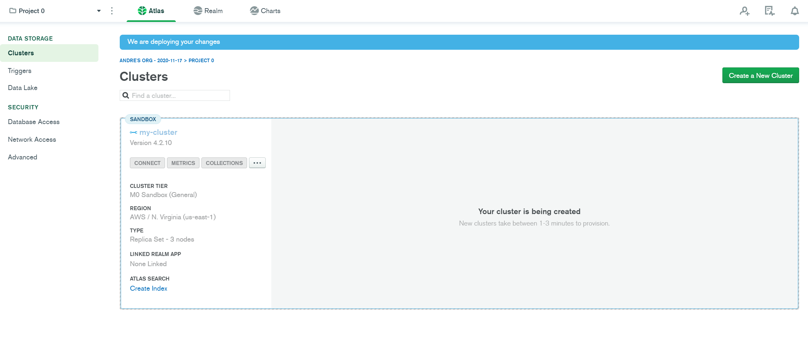
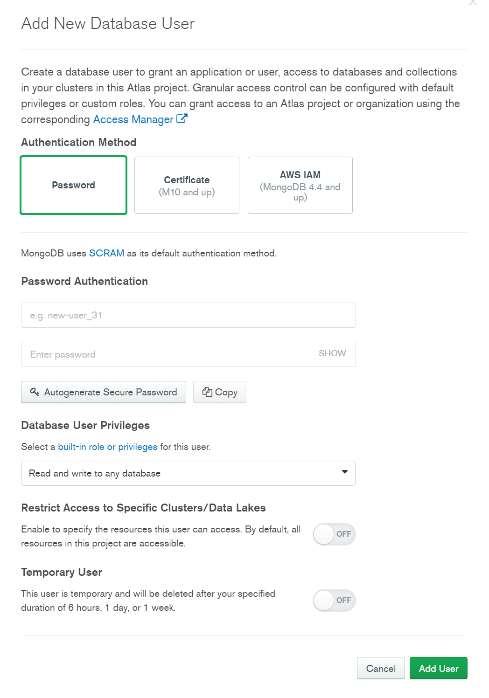
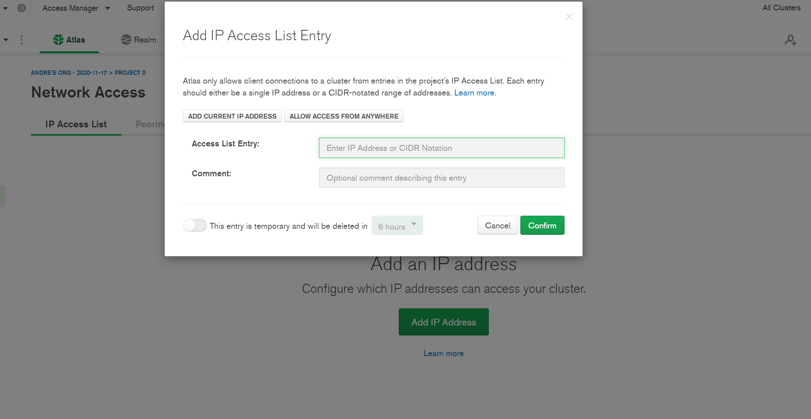
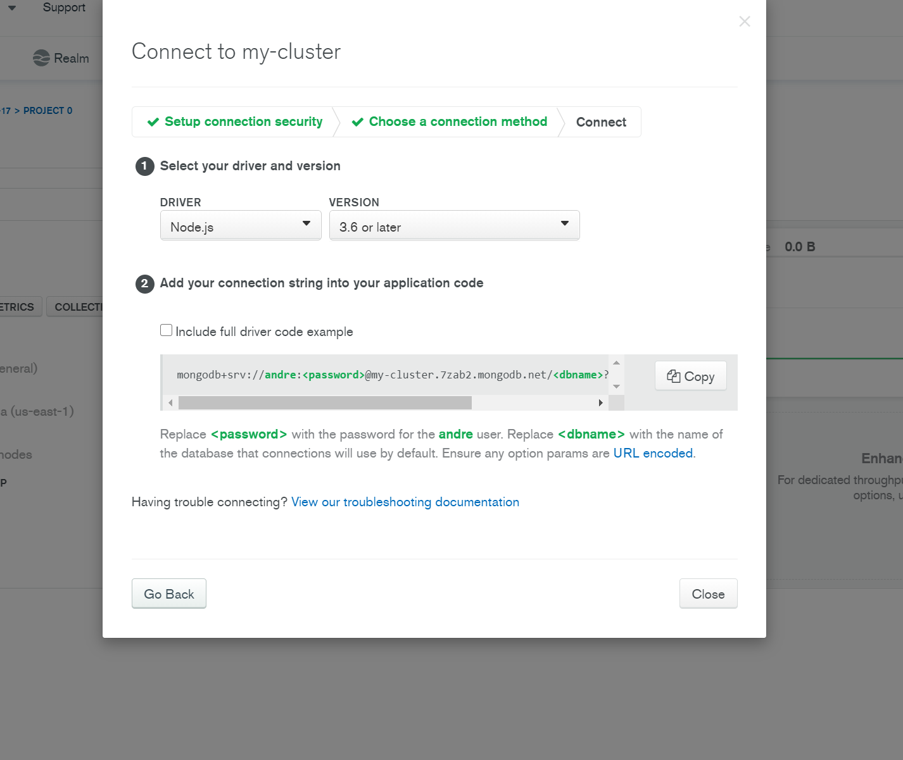

# MERN App Deployment


## Objectives

- Deploy server to Heroku
- Deploy database to MongoDB Atlas
- Deploy React app to either Netlify or Heroku

## Disclaimer

This repo is set up assuming that your apps are stuctured the same way we've done them in class.

# MongoDB Atlas

Once you've signed in to MongoDB Atlas, let's set up your account:


- Give Your Organization a name.

- Create a project name.

- Select your preferred language, `javascript` should be your preferred.

When choosing a path, select the free tier.


### Creating A Cluster

Once you've selected a tier, let's set up our cluster/database.


You can leave most of these settings as default, double check that your `Cluster Tier` is `M0 Sandbox`. Give your cluster a name, ideally this should be the name of your database.

You cluster should now be provisioning.



### Creating A Database User

Click on `Database Access` on the left sidebar. Create a new database user.



**Don't lose this password!**

### Database Access Control

Select the `Network Access` option from the left sidebar. And click on `Add IP Address`.



Select `Allow Access From Anyhwere`. Confirm your changes.

### Connecting Your Database

Select the `Clusters` option on the left sidebar and click on `CONNECT` underneath your cluster name.


Select `connect your application`:



Copy the connection URL, do not lose this!

## Wiring Up Our Code

We now need to prep our code for deployment.

Let's install the `dotenv` package to read environment variables:

**_Note: This should be done along side your server code, or your base directory for your project._**

```sh
npm install dotenv
```
**NOTE: Only do this step if you have environment variables**

```sh
touch .env
```

In your `server.js`:


- > Telling Express to serve our react app:
  >
  > **NOTE**: **This should be added with your other middleware**
  >
  > ```js
  > app.use(express.static(`${__dirname}/client/build`))
  > ```
  >**NOTE**: **This should be added just before `app.listen`**
  > ```js
  >app.get('/*', (req, res) => {
  >  res.sendFile(`${__dirname}/client/build/index.html`)
  >})
  

Modify your `db/index.js` to the following:

```js
const mongoose = require('mongoose')
require('dotenv').config() // Add this line

let dbUrl = process.env.NODE_ENV === 'production' ? process.env.MONGODB_URI : 'mongodb://127.0.0.1:27017/todo_tracker'

mongoose
  .connect(dbUrl)
  .then(() => {
    console.log('Successfully connected to MongoDB!')
  })
  .catch((e) => {
    console.error('Connection error', e.message)
  })
mongoose.set('debug', true)
const db = mongoose.connection

module.exports = db
```
Next, in your `package.json` for your **server**, add a **new** script in your `scripts` section:

```json
    "build": "cd client && rm -rf build && npm install && npm run build"
```

## Proxy requests in development to server

In `client/package.json` add just above `"scripts": {`

```js
"proxy": "http://localhost:3001",
```

## Initializing A Heroku App

In your project folder type in the following command:

```sh
  heroku create
```

This will create a Heroku app for you.

Next, we'll add our MongoDB connection string to Heroku for our Atlas Database:

**Replace `<your password>` and `<dbname>` with the user password for your database and database name, respectively. Remember, these must be an exact match.**

```sh
heroku config:set MONGODB_URI='mongodb+srv://<username>:<database_password>@<cluster>.i57hr.mongodb.net/<database_name>?retryWrites=true&w=majority'
```

Finally we'll add, commit, and push our changes to Heroku:

```sh
git add .
git commit -m <some message>
git push heroku main
```

The `git push heroku main` will only push the changes to Heroku. To push them to GitHub enter the following:

```sh
git push
```

We can monitor what our app is doing with the following command:

```sh
heroku logs --tail
```

## Recap

In this lesson, we successfully deployed our MERN app to Heroku. The server will render the `built` React app and handle the clients API requests.
We used MongoDB Atlas to host our Mongo database.

## Resources

- [Heroku Docs](https://devcenter.heroku.com/categories/heroku-architecture)
- [Atlas Docs](https://docs.mongodb.com/)
